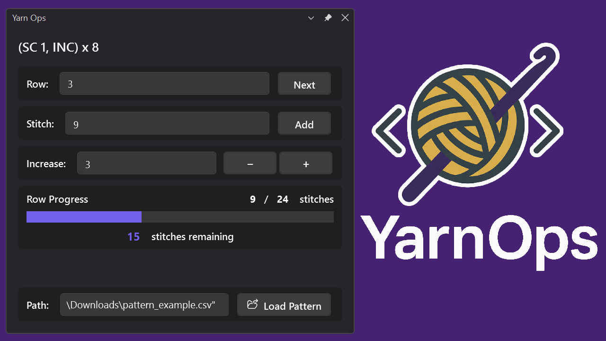

# YarnOps - Visual Studio Extension



## Why Use YarnOps?

A lightweight Visual Studio extension that helps developers stay mentally engaged during long builds by providing a minimal knitting/crocheting project tracker right inside the IDE. Designed to fill idle time without causing distraction, the tracker is general enough for various crafts and focuses solely on progress tracking. No reminders, timers, or motivational prompts—just a clean, accessible way to log progress and return to coding when builds complete.

### Perfect for:
- **Long build times** - Keep your hands and mind occupied while waiting
- **Test runs** - Make productive use of debugging downtime  
- **Background tasks** - Track progress during deployments, package installations, or CI/CD runs
- **Mental breaks** - Switch contexts briefly without leaving your development environment
- **Fiber crafts** - Knitting, crocheting, cross-stitch, embroidery, and other stitch-based projects

## Features

- 🧶 **Row-by-row progress tracking** with automatic instruction display
- 📊 **Visual progress indicators** showing completion percentage and remaining stitches
- 📁 **Pattern file support** for structured project tracking
- ⚡ **Quick stitch counters** with customizable increment values
- 🎯 **Minimal interface** designed to complement, not distract from coding

## How to Use

### 1. Opening the Tracker
- Go to **View** → **Other Windows** → **Yarn Ops**

### 2. Basic Tracking
- **Row Counter**: Manually track which row you're working on
- **Stitch Counter**: Count stitches as you work with customizable increments
- **Next Row**: Click to advance to the next row and reset stitch count

#### Loading a Pattern
1. Create or obtain a pattern file (see **Pattern File Format** below)
2. In the **File Path** field, enter the full path to your pattern file
   - Tip: Use "Copy as path" in Windows Explorer and paste directly
3. Click **Load Pattern** to import your project

## Pattern File Format

YarnOps expects pattern files in **CSV format** with the following structure:

### Required Format
```csv
"Row instruction or description","Total stitches in row"
"Cast on 40 stitches","40"
"Row 1: *K2, P2* repeat to end","40"
"Row 2: *P2, K2* repeat to end","40"
"Row 3: Knit all stitches","40"
```

### Format Rules
- **Two columns**: Instruction text and total stitch count
- **Quotes recommended**: Wrap instructions in quotes to handle commas and special characters
- **Numeric second column**: Must be a valid integer (use 0 if no specific count)
- **One row per line**: Each line represents one row of your pattern

### Example Patterns

#### Simple Scarf Pattern
```csv
"Cast on 30 stitches","30"
"Row 1: Knit all","30"
"Row 2: Purl all","30"
"Row 3: Knit all","30"
"Row 4: Purl all","30"
"Repeat rows 1-4 until desired length","30"
"Cast off all stitches","30"
```

#### Crochet Granny Square
```csv
"Magic ring with 6 sc","6"
"Round 2: 2 sc in each st","12"
"Round 3: *sc, 2 sc in next* repeat","18"
"Round 4: *sc 2, 2 sc in next* repeat","24"
"Round 5: *sc 3, 2 sc in next* repeat","30"
```

## Support and Contributing

- **Issues**: Report bugs and feature requests on [GitHub Issues](https://github.com/jumattos/YarnOps/issues)
- **Discussions**: Share patterns and usage tips in [GitHub Discussions](https://github.com/jumattos/YarnOps/discussions)
- **Contributing**: Pull requests welcome!

## Acknowledgments

Created for developers who believe that productive downtime makes for better code and happier crafters. Whether you're knitting through kernel builds or crocheting during CI/CD pipelines, YarnOps helps you make the most of those inevitable waiting moments in software development.

---

*Happy coding and crafting!* 🧶👩‍💻